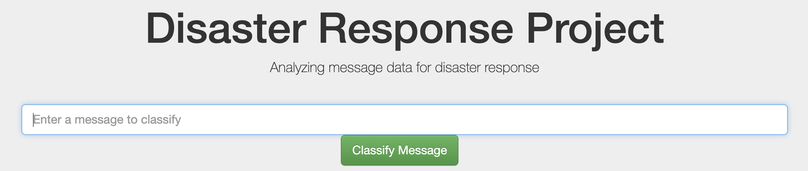
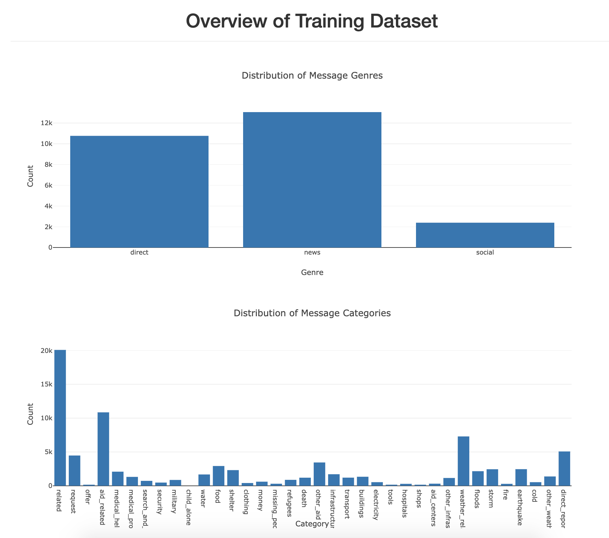
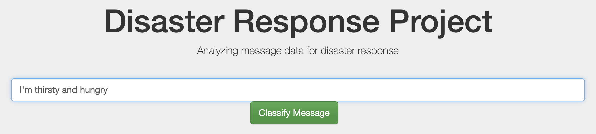
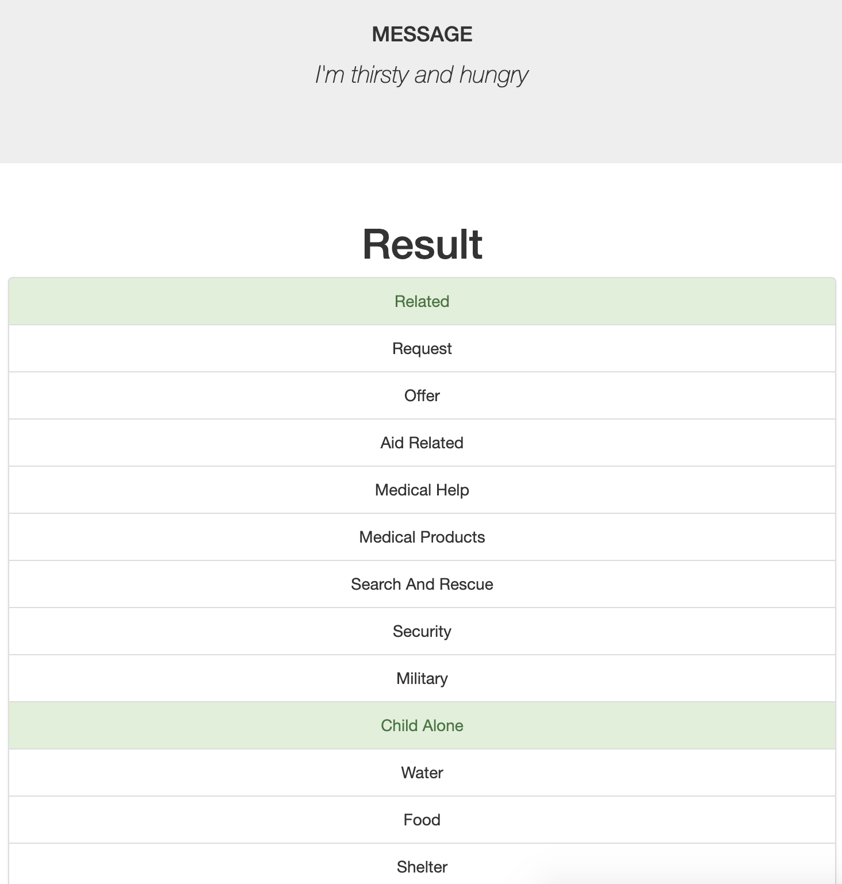
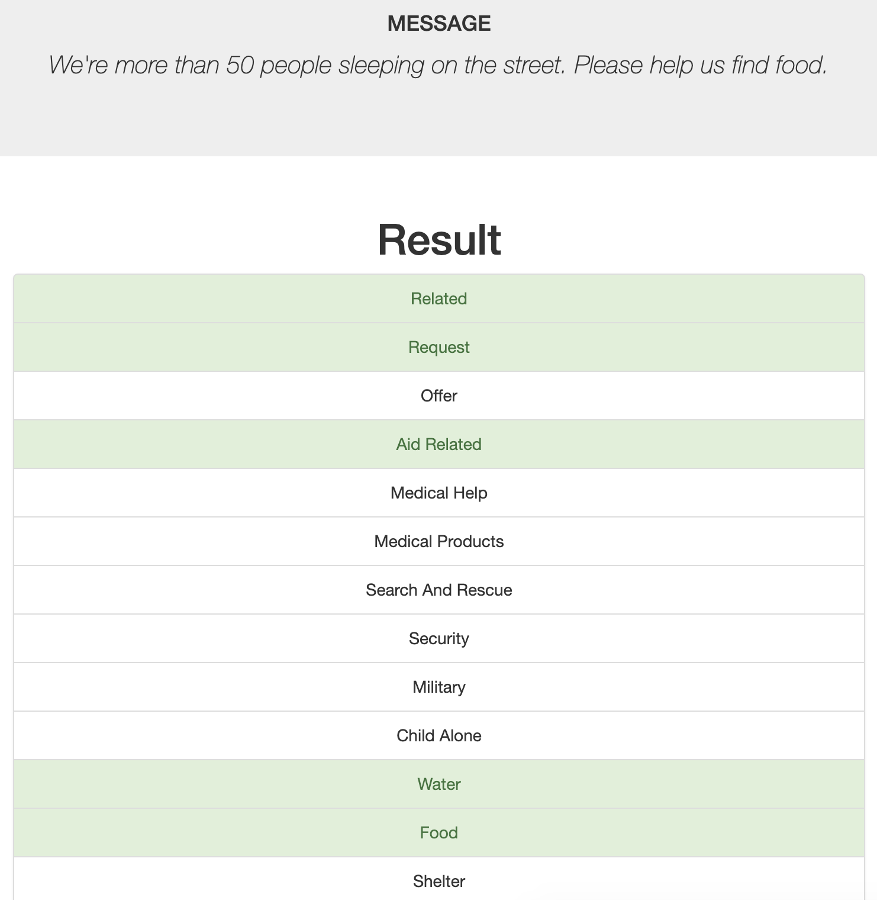

# Build Disaster Response Pipelines: Udacity Data Science Nanodegree Project

### Table of Contents
1. [Goal](#goal)
2. [Data](#data)
3. [Python libraries](#python-libraries)
4. [File descriptions](#file-descriptions)
5. [How to run the Python scripts and web app](#how-to-run-the-python-scripts-and-web-app)
6. [Screenshots of the web app](#screenshots-of-the-web-app)
7. [Acknowledgment](#acknowledgment)

### Goal
- Build a Natural Language Processing (NLP) model for a web app that classifies disaster messages
- This project is organized in the following order:
  - Build an ETL pipeline to extract datasets, clean up, and save the clean dataset into an SQLite database.
  - Build a machine learning pipeline to create and train an NLP model that classifies disaster messages into corresponding categories.
  - Create a web app that can help emergency workers: they can input a new message in the web app and get classification results in several categories (e.g. floods, storm, earthquake, etc), then the message can be sent to an appropriate disaster relief agency.

### Data
- Disaster data provided by [Appen (Figure Eight)](https://appen.com/): The dataset contains pre-labeled real-world messages that were sent during disaster events.

### Python libraries
- Machine learning libraries: pandas, sklearn
- Natural language process libraries: nltk
- SQLite Database libraries: sqlalchemy
- Model save/load libraries: pickle
- Web app libraries: flask, plotly

### File descriptions
1. app/
    - run.py: a python script for the web app
    - templates/*: templates for launching the web app

2. data/
    - disaster_messages.csv: real-world messages provided by [Appen (Figure Eight)](https://appen.com/) 
    - disaster_categories.csv: categories of the messages provided by [Appen (Figure Eight)](https://appen.com/) 
    - process_data.py: ETL pipeline to extract datasets, clean up, and save the clean dataset into an SQLite database
    - ETL Pipeline Preparation.ipynb: Jupyter Notebook file for building the ETL pipeline
    - DisasterResponse.db: clean dataset
3. models/
    - train_classifier.py: machine learning pipeline to create and train an NLP model that classifies disaster messages into corresponding categories
    - classifier.pkl: trained model
    - ML Pipeline Preparation.ipynb: Jupyter Notebook file for building the machine learning pipeline

### How to run the Python scripts and web app
1. Run the following commands in the project's root directory to set up your database and model.

    - To run ETL pipeline that cleans data and stores in database
        `python data/process_data.py data/disaster_messages.csv data/disaster_categories.csv data/DisasterResponse.db`
    - To run ML pipeline that trains classifier and saves
        `python models/train_classifier.py data/DisasterResponse.db models/classifier.pkl`

2. Run the following command in the app's directory to run your web app.
    `python run.py`

3. Go to http://0.0.0.0:3001/

### Screenshots of the web app
- The main page shows the overview of the training dataset including message genres and categories.
  
  
- For example, enter "I'm thirsty and hungry" and click the "Classify Message" button.
  
  
- Then, we can see the corresponding categories highlighted in green: Related, Child Alone.
  
  
- For another example, enter "We're more than 50 people sleeping on the street. Please help us find food." The corresponding categories are Related, Request, Aid Related, Water, and Food.
  

### Acknowledgment
- This project is part of the [Udacity Data Science Nanodegree](https://www.udacity.com/course/data-scientist-nanodegree--nd025) program.
